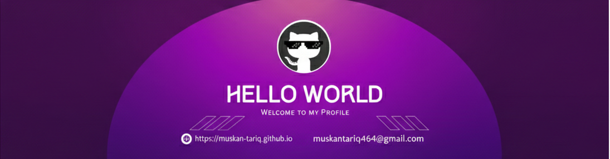

<!--Banner-->

<!--Night Owl image-->

  

<!--Header Name-->
#  ɪ'ᴍ ᴍᴜsᴋᴀɴ! 
Digital Craftsman (Developer / Programmer)
  

<!--Start Intro-->               

👩‍💻 About Me

I’m a Software Engineer with experience in full-stack development, AI-driven systems, and agentic workflows.  
I enjoy building production-ready applications, working with APIs, automation, and LLMs, and turning ideas into scalable solutions.

- 💻 Full-Stack experience through job & real-world projects  
- 🤖 Interested in AI, LLM integration & multi-agent systems  
- 🚀 Love building things that real users actually use  
- 🌱 Always learning — especially system design & scalable architectures  

---
- 💻 Visit my [Portfolio]https://my-portfolio-chi-dun-83.vercel.app/) for more details about me.
<!--End Intro-->

<!--Profile Count Badge-->

  

---

<!--Languages and Tools Section-->       
<h2 align="center">Tᴇᴄʜ sᴛᴀᴄᴋ & Lᴀᴛᴇsᴛ ʙʟᴏɢs</h2> 
<picture>
  <source media="(prefers-color-scheme: dark)" srcset="./Skills_Animation_Dark.gif">
  <source media="(prefers-color-scheme: light)" srcset="./Skills_Animation_White.gif">
  
</picture>
 

<h3 align="left">Current Learning</h3>
<ul align="left">
  <li>Languages: Python, JavaScript, TypeScript, Java, C++  </li>
  <li>Frontend: React, Next.js, Vue.js, Angular, HTML, CSS </li>
  <li>Backend & APIs: FastAPI, Node.js, REST APIs  </li>
  <li>AI & Agentic Systems: LLMs (LLaMA), Prompt Engineering, NLP, Transformers   </li>
  <li>Databases: PostgreSQL, MySQL, MongoDB</li>
  <li>Tools & DevOps: Git & GitHub, Docker, Linux, Vercel, Supabase</li>
</ul>

    

<!--Github stats Table--> 
<h2 align="center">📊 GitHub Stats 📊</h2>

<table width="100%">
  <tr>
    <td width="50%">
      <h3 align="center">GitHub Stats</h3>
      

        
      

    </td>
    <td width="50%">
      <h3 align="center">Streak Stats</h3>
      

        
      

    </td>
  </tr>
</table>

 

### 🚀 Featured Projects

#### 🔹 Integrow – AI-Driven SDLC Automation Platform (FYP)
- Multi-agent system that automates software lifecycle stages  
- LLM-powered analysis using LLaMA 3.3  
- Backend built with FastAPI, frontend with Next.js + Electron

#### 🔹 Customer Sentiment Analysis Agent
- NLP-based sentiment detection using transformer models  
- Analyzes customer reviews to extract actionable insights  
- Built using Python, HuggingFace, and deep learning models

#### 🔹 HairLocks – Real Business Website
- Full-stack web application serving real customers  
- Focused on performance, UI consistency, and scalability  

 

<!--Contribution Graph-->
<h2 align="center">📈 Contribution Graph 📈</h2>

    

---

<!--Dynamic Quote card updates everyday at 12 PM--> 
<h2 align="center">🌟 Thought of the Day 🌟</h2>

    

---

<!--Contact Section--> 
<h2 align="center">🤝 Connect With Me 🤝 </h2>

  

 

<!--Buy me a coffee-->

<!--Footer--> 

  

